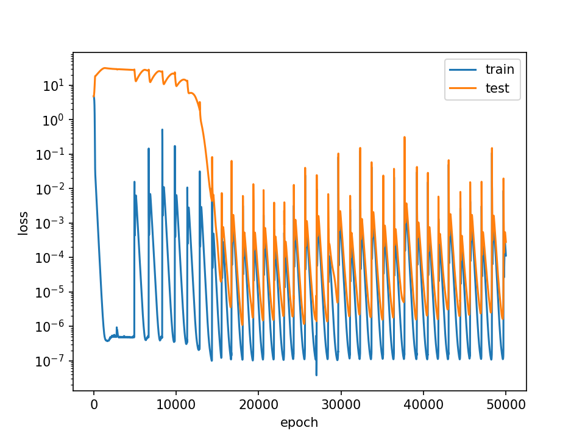
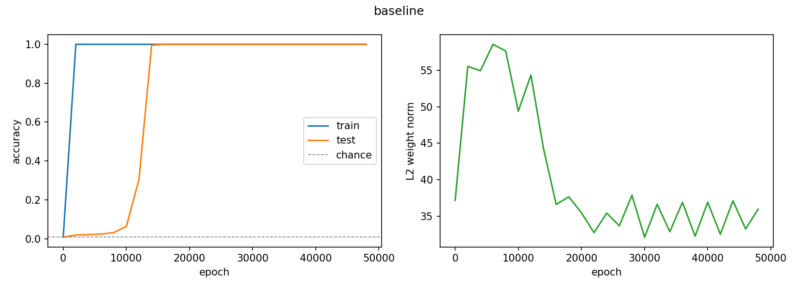
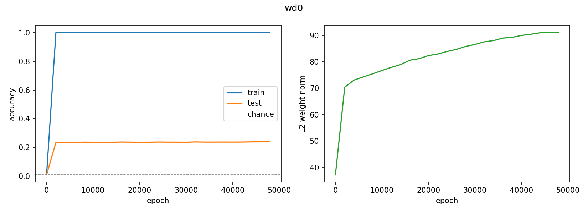
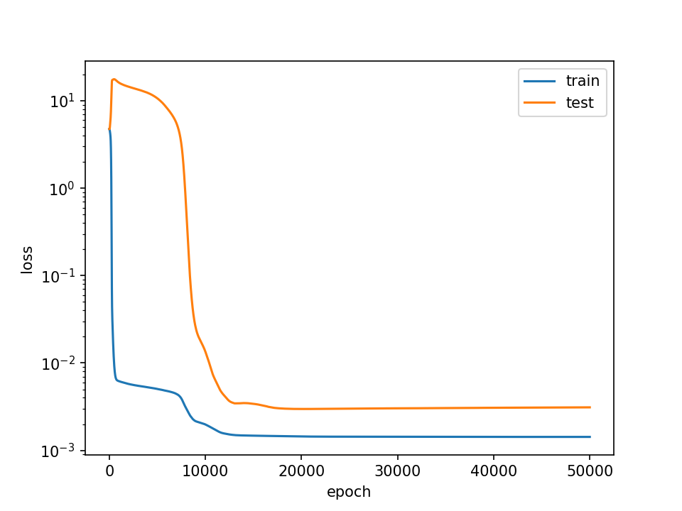
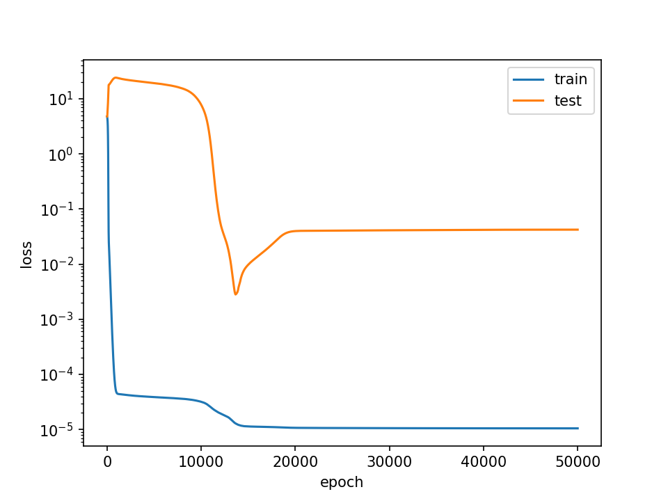
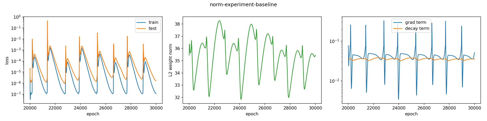
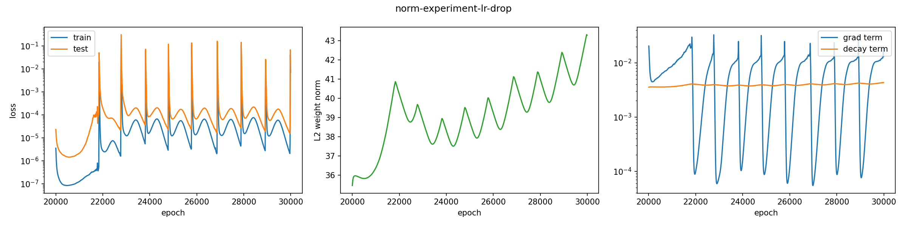
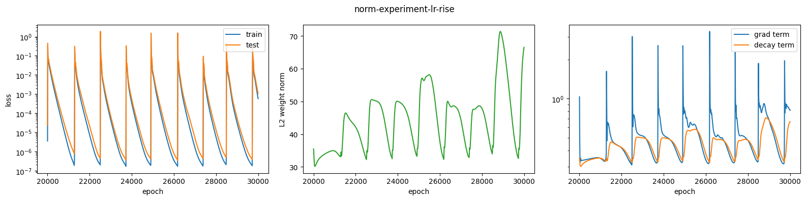
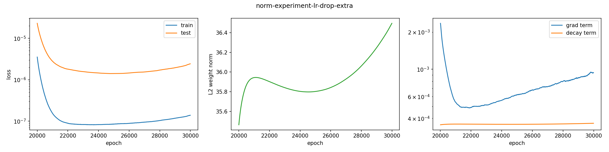

# Reproducing Grokking from Scratch in PyTorch

> A from-scratch PyTorch reproduction of grokking on modular addition (1-layer transformer, Nanda-style setup), with six experiments over weight decay, data fraction, learning rate and Adam's ε, plus a mechanistic investigation of the slingshot effect - its cause confirmed by ablation and its weight-space effects measured directly.

## 1. Introduction

A model trained on a small algorithmic task first memorizes its training data and then, thousands of epochs after train loss hits zero, abruptly generalizes. It's exactly the delay between memorization and generalization that is the phenomenon - **grokking**, first discovered by Power et al.

The goal of the project was to reproduce Nanda's setup to build fluency with PyTorch, tensor manipulation and transformer internals. It then grew into six experiments (weight decay, two data fractions, a learning rate probe, an ε ablation, and a learning rate sweep with the optimizer's forces logged directly), each with predictions made beforehand so experimental hygiene could be practiced. When optimizer instability showed up unplanned (the slingshot effect), it was investigated further: probing the mechanism, an ε test of its fix and a direct measurement of its effect on the weights.

The project does not attempt to reverse engineer the learned circuit - this was left out as it wasn't the intended goal.

## 2. Setup

The task given to the model was modular addition: predicting `(x + y) mod 113`. This is a standard grokking testbed from Power et al. and Neel Nanda's analysis. The input format is three tokens, x y =, the vocabulary is size 114 (0-112 plus the = token). The model predicts at the final position only, the loss is cross-entropy on that position and the other two positions are unsupervised. The dataset is the complete enumeration, all 113² = 12,769 combinations. Train and test are random partitions of that grid. (30% train = 3830 pairs at baseline). Every epoch is one full-batch pass over the entire train set.

The model is a 1-layer transformer. Learned token plus positional embeddings, one attention block (4 heads, width of each head is 32), one MLP (width 512, ReLU), linear unembed. The residual stream is 128 throughout, there is no LayerNorm and no dropout. Roughly 200k parameters. The code was written from scratch in plain PyTorch by following the architecture of Nanda's reference but with the code rederived. This was done to deepen understanding about transformer architecture and to gain tensor fluency.

### Training Config

| parameter | value |
|---|---|
| optimizer | AdamW |
| lr | 10⁻³ |
| eps | 10⁻⁸ |
| weight decay | 1.0 |
| betas | (0.9, 0.98) |
| batch | full (all train pairs per step) |
| epochs | 50,000 (baseline) |
| frac_train | 0.3 (baseline) |
| hardware | Colab T4 |

The weight decay is so high precisely because we want to induce grokking, and a big regularization pressure does exactly that. The data split and model were seeded.

## 3. Baseline result

*Baseline run (wd = 1.0, frac_train = 0.3). Train loss converges within a few hundred epochs; test loss generalizes ~10k epochs later — **the delay is grokking**. The recurring spikes are slingshot instabilities.*

*Baseline run, showing accuracy and L2 weight norm. Train accuracy reaches ceiling by ~2k while test sits at chance until the ~10k transition; L2 norm rises during the memorization phase, peaks in the plateau and then falls during the transition to the generalization circuit. The post-transition oscillation is the slingshot cycle in weight space.*

### Grokking

The reason grokking happens in the first place is the following. Weight decay acts like a regularization force that penalizes large weights. The memorizing solution stores 3830 arbitrary answers and needs a large L2 norm to do it, while the generalizing circuit computes them with a much smaller norm. The weight decay pressure eventually favors the circuit. The hyperparameter of 30 percent training samples sits in the window where memorization is possible but costly.

The actual training follows a three act arc. Almost immediately in the first few hundred epochs the training loss collapses to 10⁻⁶ which means the model has memorized the training set. Meanwhile test loss rises above chance because the model's memorization machinery confidently produces wrong answers for the unseen pairs.

The model stays at this plateau of high test and low train loss for 10k epochs. It looks like nothing is happening but then suddenly...

...the cliff happens at around 10-12k. Test loss drops off by four orders of magnitude, the model suddenly generalizes. The delay between this and the train convergence is around 10k epochs. **Exactly this is grokking.** The delay exists because the model is silently building up the general circuit in parallel while memorization carries the loss. The cliff is the cleanup.

*My own prediction before running the experiment was that train would reach the lows at around 5k epochs and that test would reach it around 25k.* I was very conservative on both fronts, since train happened in the first few hundreds and test at around 10-12k.

### The slingshot effect

The slingshots are the recurring spikes, the loss jumping several orders of magnitude from the 10⁻⁷ floor up to 10⁻¹–10⁰. It recovers within a few hundred epochs and repeats quasi-periodically for the entire post-grok run.

This mechanism matches the "slingshot mechanism" identified in Thilak et al. It's a known instability of adaptive optimizers at very low loss. The reason is that Adam's normalization amplifies noise once gradients stay near zero long enough (mechanism in 4c).

Two key observations need to be noted. The first is that both curves spike and recover together. The second is that the model always falls back to the generalizing solution, never back to memorization.

An important fact is that this phenomenon occurred in every single configuration run where ε = 10⁻⁸. wd ∈ {0,1}, frac_train ∈ {0.1,0.3,0.5}, lr from 10⁻⁴ to 10⁻². **At that ε it's a constant.** The exceptions are raising ε (4e) and the lowest lr arm, where the cycle apparently stretches past the observed window (4f).

In conclusion it's an interesting unplanned second phenomenon that reproduced alongside the planned one.

## 4. Experimental variations

### 4a Weight decay = 0

*wd = 0, frac_train = 0.3. Test loss (orange) never generalizes — it climbs past 100 nats and keeps rising; train (blue) memorizes to 10⁻¹⁰; slingshot spikes persist without weight decay.*

*Train accuracy reaches the ceiling by the first checkpoint, while test accuracy gets to ~23% and stays there. This is well above chance but still far below generalization; L2 norm rises monotonically because there is no regularization pressure.*

*The predictions for this experiment were the following. The first was that there would be no grokking. The reason is that if wd is 0 there would be no pressure for the model to use the more efficient solution. For the train loss the prediction was that it would overfit even harder since nothing is opposing weight growth, in other words there is no regularization present. In the case of the slingshots the prediction was that they would persist since memorization alone would reach the near-zero-gradient regime where slingshots arise.*

The result confirmed all three. The test loss never dropped and it actually kept rising with the epochs. Train loss reached 10⁻¹⁰ vs the baseline's 10⁻⁶. The slingshot spikes also appeared as predicted.

The test loss is around 100 nats, while chance loss is around 4.7 which means that the model is confidently very wrong about its predictions. Surprisingly though, it plateaus at ~23% accuracy for the test set, which is 25x above chance. These two metrics measure two different but related things, accuracy asks only if argmax is right while CE weighs by confidence without bounds - one network can hold both numbers as is seen here. It gets a stable minority of test pairs right and the other majority wrong with such extreme confidence it swamps everything. Pure memorization shouldn't transfer therefore the explanation is that the network did in fact learn some parts of the generalization machinery. This is consistent in magnitude with partially exploited commutativity, which would cap at ~30% on this split (direct check left for future work).

This experiment shows that **wd is necessary for grokking, but not for slingshots,** the near-zero-gradient regime gets reached either way. Without wd you get a frozen partial structure that shows glimpses of generalization.

### 4b Fraction of training data = 0.5

*wd = 1.0, frac_train = 0.5. Test loss (orange) falls almost together with train (blue) — the ~10k delay of the baseline collapses to under ~1–2k epochs. Grokking nearly disappears when data is plentiful.*

*The prediction for this experiment was that the model groks earlier since it has two forces in the same direction. More pairs makes memorization more expensive and more training samples means the signal for finding the generalizing circuit is richer therefore it is found faster. The magnitude call was around 6-7k from the 10-12k baseline, naively inverse proportional to the increase of frac_train from 0.3 to 0.5, which is around 1.67x.*

The results confirm the direction of the prediction but expose that the magnitude was actually conservative by 5x. Test loss falls essentially with the train loss, **the delay between the losses is only about 1-2k which is very slim and it could arguably be said that no grokking is occurring, only phase change.**

This is in line with Power et al.'s findings where adding data shortens the wait for generalization disproportionately. The main takeaway is that **grokking is phase change and limited data combined.** At 0.5 that window is closing and the phase change is just training.

### 4c Learning rate drop (mechanism check on the slingshots)

*Baseline resumed from epoch 20k with lr lowered 10× (10⁻³ → 10⁻⁴), wd unchanged. Spikes shrink by ~2 orders of magnitude but persist — a calm ~1.5k epochs precedes the first spike while the fresh optimizer state decays.*

The setup for the experiment was taking the baseline model that grokked and resuming it from its 20k epochs checkpoint and continuing its run until 50k epochs, but with a lowered learning rate, from 10⁻³ down to 10⁻⁴. A fresh optimizer was used, everything else was left as is.

This experiment checks the mechanism behind the slingshots. It is a known quirk of the Adam optimizer.

Adam maintains two exponential moving averages, average of recent gradients - m (β₁ = 0.9 -> short ~10 step memory) and an average of recent squared gradients - v (β₂ = 0.98 -> ~50 step memory). The formula is essentially `step ∝ lr · m / (√v + ε)`, which means each param's raw gradient gets normalized by its own recent gradient scale.

This breaks because loss in this experiment reaches 10⁻⁷. The small loss causes small gradients. But they aren't just small, they are small for thousands of steps, and full batch training means no sampling noise to prop them up. As both m and v shrink together (because they are both relative to the size of the recent grads) their ratio stays in the order of 1. This is a problem because that means the step doesn't get smaller, it is roughly the size of the lr. And at a certain point instead of pointing in the direction of the gradient it points in the direction of the noise because Adam can't differentiate them due to magnitude.

The working picture of the kick is that the model sits at the bottom of an extremely flat and narrow basin (such a small loss 10⁻⁷ means the model is finely tuned) while the optimizer keeps making learning-rate-sized steps in noise-determined directions instead of gradient ones. Each step is small in the absolute weight space, but the basin floor is smaller than that. Eventually the random walk exits the basin, and because m is faster while v lags behind the exit gets amplified. For a few steps the denominator says the grad is small but the numerator says the grad is big and then the ratio spikes, the steps become huge, and the model gets slingshotted out of the basin. That lag between m and v is the slingshot (this is further probed in 4e-4f).

The reason recovery is possible is that the gradients again get large and consistent. The ratio sanitizes and Adam starts working normally again and everything repeats.
The caveat is that ε at its default is too small here (10⁻⁸). A larger value would, in theory, raise the floor and prevent this from happening by reducing drifting and exiting the basin and by removing the amplification caused by lag (tested in 4e).

*The prediction was that the spikes shrink roughly with the learning rate. The alternative was that they vanish entirely if the smaller kick can't escape.*

The prediction was **right in direction but wrong in magnitude** - the spikes shrank by ~2 orders of magnitude for a 10× lr drop, not "roughly with lr". The peaks shrank but didn't vanish - from peaks of around 10⁻¹–10⁰ in the baseline to 10⁻³–10⁻² here. Since both runs start from the identical epoch 20k weights and differ only in the learning rate, the shrinkage therefore must be from the learning rate itself. 

Three interesting observations came out of it as well. The first was that the fresh Adam needed time to decay into the danger zone and was stable for about 1.5k epochs. The second was that the train loss was lowest in the calm around 10⁻⁷ and that the same number was never reached afterwards. This was because the learning rate is 10x lower and the optimizer doesn't have time to reach the basin's floor before the kick arrives again. The third was that test loss valleys actually get progressively lower, but still don't quite reach the first valley during the calm.

### 4d Fraction of training data = 0.1

*wd = 1.0, frac_train = 0.1, run extended to 100k epochs. Test loss (orange) stays pinned at 30–70 nats throughout - no generalization, no downward trend. Train (blue) memorizes and slingshots indefinitely.*

*The prediction was that grokking could still occur but maybe past 50k epochs so the experiment was continued up to 100k epochs. The logic was that there would still be enough pressure to force the model to use the generalizing circuit, just that it would require more time.*

The results proved the prediction wrong. **The model never succeeded in generalization and it stayed stuck in memorization.** The test losses were pinned at around 30-70 nats through all the epochs with no downward trend at any point. The reason is that even though generalization should still be cheaper than memorization - the small amount of data needed to be memorized (1,276 pairs) doesn't exert enough pressure with the given weight decay - and therefore the model never switches to the generalization circuit since it doesn't see a need to. Power et al. got a similar kind of result. At this fraction of the training data the time to generalization grows steeply. **The conclusion we reach from this and 4b is that both too much and too little data can close the grokking window.**

### 4e Does raising ε stop the slingshot spikes?

4c's mechanism ended with a testable claim which was to raise the ε floor, this section does exactly that. It's two new fresh runs compared against the baseline run, in total testing three ε values: 10⁻⁸ (the baseline, section 3), 10⁻⁶ and 10⁻⁴.

*The prediction was that a high enough ε value kills the spikes entirely; grokking still happens, but maybe slightly later since the big gradients are barely affected.*

*ε = 10⁻⁴, everything else baseline. We can see a standard grokking transition starting around ~8k with zero spikes across the 50k epochs. Floors are at ~1.4 × 10⁻³ train and ~3 × 10⁻³ test. It must be noted these floors are higher than the ε = 10⁻⁸ run's (train ~10⁻⁷). This was expected because a big ε makes steps shrink when gradients are tiny, so the optimizer stops descending earlier.*

*ε = 10⁻⁶, everything else baseline. We can see the spikes vanish here as well, but that the grokking transition starts somewhat later at ~12k. We also must note the anomaly that happens - test loss dips to ~3 × 10⁻³ at ~13k then rises and settles to ~4 × 10⁻², which is an order of magnitude worse than the 10⁻⁴ floor.*

The results confirm the main predictions. At both of the higher ε values the spikes are completely gone while grokking still happens. The mechanism's fix works which is strong evidence that the floor story's core is right. The 'slightly later' part was half right: 10⁻⁶ transitions later (~12k), 10⁻⁴ is on time.

There is a caveat worth mentioning which is that the spike-free losses come at a cost. Both large-ε arms stop descending earlier because the same damping that kills the spikes caps convergence depth.

There is also an anomaly that happens in the ε = 10⁻⁶ run which is that the test loss shows a dip-then-rise that then settles an order of magnitude worse than the ε = 10⁻⁴ run's floor. This is contradictory to the theory which would imply that the smaller ε value has less damping and should therefore have a bigger convergence depth. It's only one run so the behavior could be due to the single seed tested.

### 4f What the spikes do to the weights

*lr = 10⁻³, resumed from baseline epoch 20k, fresh optimizer, ε = 10⁻⁸. The spikes knock the norm around ~5 units per hit - oscillating between 32-38 with no trend. The right panel displays the per-step push (gradient) and pull (decay) on the weights.*

*lr = 10⁻⁴, resumed from baseline epoch 20k, fresh optimizer, ε = 10⁻⁸. Here the knocks move the norm only by ~1 unit but an upwards trend can be noticed - the norm climbs from 36 to 43. On the right panel it can be noted that the balance (where the orange is relative to the blue) is shifted upwards a bit.*

*lr = 10⁻², resumed from baseline epoch 20k, fresh optimizer, ε = 10⁻⁸. The knocks now move the norm by ~20 units - oscillating between 30-70. Maybe a slight trend towards bigger swing, but it can't be confidently noted. On the right panel it can be noticed the pull now oscillates as well, since it's proportional to the norm itself.*

*lr = 10⁻⁵, resumed from baseline epoch 20k, fresh optimizer, ε = 10⁻⁸. No spikes at all in the 10k window; norm nearly flat. The push is still slowly climbing toward a first spike that never arrives.*

4c left behind a puzzle - the norm behaves differently at different learning rates. Here we explore what happens by testing 4 learning rates: 10⁻⁵ through 10⁻². All the four arms start from the same 20k epoch baseline weights with a fresh optimizer at ε = 10⁻⁸ and are run for 10k epochs.

*The predictions were based on gut feeling - for 10⁻⁵ it was: more/faster spikes, more norm gain, pull weaker relative to push. For the high arm: the opposite.* 

The results killed the predictions completely. The 10⁻⁵ calls in particular were wrong on all three counts: there were no spikes, the norm was nearly static and the pull was above push most of the window.

Why is there a fight between the two forces? Cross-entropy is never satisfied: even when every answer's argmax is right, loss keeps rewarding pushing the correct logit further above the rest - softmax never hits probability 1, so there is always loss left to shave. The reason this is able to happen is because the output scale and weight scale are not decoupled in this model - there is no LayerNorm - therefore scaling the weights directly scales the logits. The result is that the gradient always contains a component pointing outward in weight space.

The push is on average the size of the learning rate. This is because Adam divides each gradient by its recent typical size, so per-step movement is ~lr regardless of how tiny the gradients get.

The pull is different, it subtracts lr·wd·w each step and is therefore proportional to the weight itself. A typical weight here: norm ~35 spread over ~227k parameters which then comes out to ~0.084 per weight. So pull ≈ lr · 1.0 · 0.084 ≈ 0.08·lr.

Since the learning rate is the same in both it cancels out: the push outweighs the pull ~12x at the current weight scale. This is consistent with the right panels, where push sits roughly an order of magnitude above the pull in the calm periods (the panels show the global norm of each force over all ~227k weights, hence the larger absolute scale — the ratio is the comparable thing). The weights would need to grow ~12x before decay could balance the push on its own. So the norm is always trying to climb, at every lr - and the reason it visibly climbs in some arms and not others can't be the balance itself. It has to be whatever interrupts the climb.

The knock sizes per spike are ~1 / ~5 / ~20 units at 10⁻⁴ / 10⁻³ / 10⁻². The outward push acts in every arm, but a net climb is only visible where the knocks are too small to erase what accumulates between spikes - which happens only at 10⁻⁴. At 10⁻³ and 10⁻² each knock is as big as or bigger than the climb between knocks, so the norm just oscillates; at 10⁻⁵ there are no knocks, but the push itself is 10× weaker and 10k epochs isn't enough time to see it. So lowering lr doesn't strengthen the push - it weakens the interruptions faster than it weakens the push.

Two interesting tidbits: accuracy is 1.0 across every sampled checkpoint (2k-epoch resolution) in all arms; the spike period is ~1.2k, roughly constant from 10⁻⁴ to 10⁻², and then apparently diverges past the window at 10⁻⁵.

The open questions left are: what times the spikes; how knock size actually scales with lr; why the period barely moves with lr then explodes; 4e's 10⁻⁶ anomaly.

## 5. Bug diary

**Loss frozen at 4.75** - loss was identical to 4 decimals every epoch. The reason was that the optimizer was created before the model was (re)instantiated, so it held parameter references to a dead object and stepped nothing. The optimizer binds at creation time, therefore recreate model = recreate optimizer.

**The causal mask wasn't applied** - the `scores.masked_fill(mask == 0, -1e10)` ran without error and did nothing. The reason was that `masked_fill` returns a new tensor rather than mutating and the result was never assigned. It was caught by printing the score matrix and noticing no -1e10 upper triangle.

**Plot crashed on loss lists** - the logging appended the raw loss tensors instead of .item() floats. The reason was that matplotlib refuses tensors that require grad.

## 6. What I didn't do

What this experiment didn't do was reverse-engineer the learned circuit itself. Reproducing the Fourier analysis Nanda does was out of scope: the point was to learn more about the architecture, tensors and the grokking phenomenon.

The open questions are the ones inherited from 4e - 4f plus the two measurements designed but not run: accuracy logged densely enough to see inside a spike (4f's checkpoints are too coarse), and splitting the wd0 test accuracy by whether a pair's mirror was in train (the commutativity check from 4a).

The next steps are using the logit lens across the saved baseline checkpoints to inspect the general circuit forming during the plateau when the loss curves don't indicate anything is happening.

## 7. What I learned

The main goal was being more confident with tensor mechanics. I would say I succeeded, every shape was first predicted then checked and confirmed. Some tensor theory was also revisited, like the embedding lookup, broadcasting, softmax along an explicitly chosen axis.

More confidence was gained in regard to the transformer as well, especially the parameters, which matrix lives where, their shapes, and how the dimensions relate.

An unexpected thread where I learned something new was with slingshotting and Adam's internals, which demystified the optimizer a bit.

The last point is experimental hygiene. Every claim in section 4 rests on predictions written before the final results were in, which exercised my intuition and applied knowledge. Scoring them showed exactly where my mental model was off.

## References

1. Power, A., Burda, Y., Edwards, H., Babuschkin, I., & Misra, V. (2022). *Grokking: Generalization Beyond Overfitting on Small Algorithmic Datasets.* [arXiv:2201.02177](https://arxiv.org/abs/2201.02177)

2. Nanda, N., Chan, L., Lieberum, T., Smith, J., & Steinhardt, J. (2023). *Progress Measures for Grokking via Mechanistic Interpretability.* [arXiv:2301.05217](https://arxiv.org/abs/2301.05217) — working reference for this project was the accompanying notebook, [A Mechanistic Interpretability Analysis of Grokking](https://colab.research.google.com/github/TransformerLensOrg/TransformerLens/blob/main/demos/Grokking_Demo.ipynb)

3. Thilak, V., Littwin, E., Zhai, S., Saremi, O., Paiss, R., & Susskind, J. (2022). *The Slingshot Mechanism: An Empirical Study of Adaptive Optimizers and the Grokking Phenomenon.* [arXiv:2206.04817](https://arxiv.org/abs/2206.04817)

## AI disclaimer

The code and the writeup were written by hand, AI was used only as a teacher with the Stanford Claude.md prompt to ensure no answer leakage.